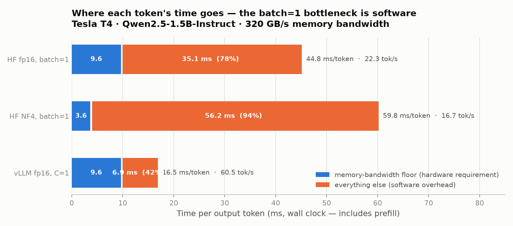
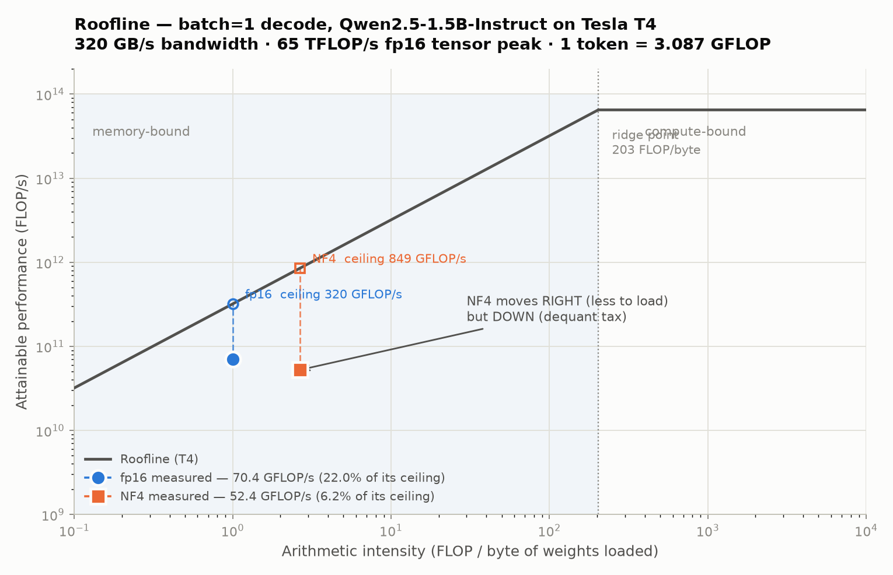
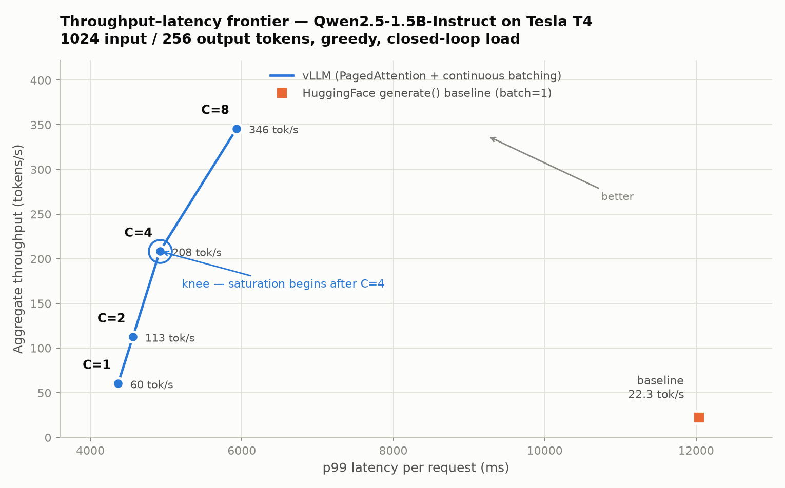
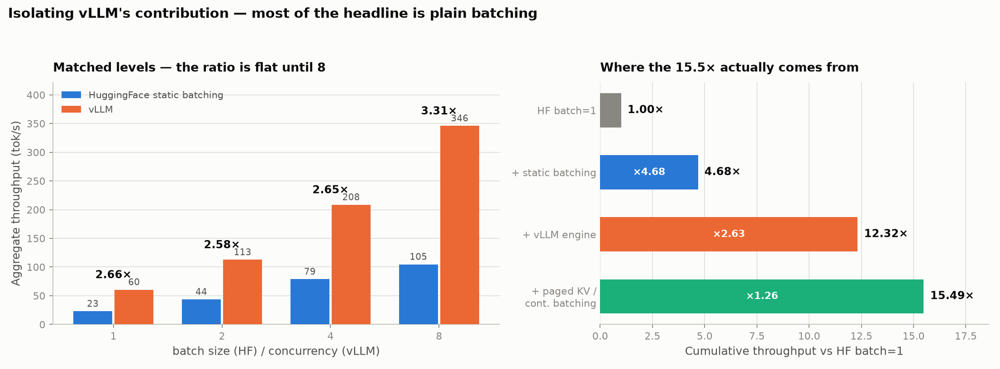

# LLM Inference / Serving Benchmark

Four inference optimizations measured on one GPU, each answering a specific question: *does
this technique help, by how much, and what does it cost?*

The headline result is a negative one. **4-bit quantization — the obvious first thing to
reach for — made decoding 25% slower.** And the framework that did win delivered most of its
advantage from plain batching, not from the sophisticated scheduling it is known for. Both
findings required separating metrics that are usually reported as a single "tokens per second."

**Model:** `Qwen/Qwen2.5-1.5B-Instruct` (1.54B params, 1.31B non-embedding, tied embeddings)
**Hardware:** NVIDIA T4 (Colab) · 16 GB · sm_75 · ~320 GB/s · fp16 only (no bf16, no FlashAttention-2)
**Software:** torch 2.11.0+cu130 — every row measured on this one stack
**Workload:** 1024 input → 256 output tokens, greedy, identical prompts across every row

---

## Measurement design

Every row imports the timing primitive from `benchmark/baseline.py`, so prompts, token counts,
warmup count and synchronization discipline cannot drift between scripts.

**Four metrics, kept separate:**

| Metric | Definition | Why separate |
|---|---|---|
| **TTFT** | clock start → first token, via `TextIteratorStreamer` on a background thread | dominated by *prefill*; scales with prompt length |
| **Decode TPS** | `(N−1) / (total − TTFT)` | *excludes* prefill — the steady-state rate, independent of prompt length |
| **Aggregate TPS** | output tokens ÷ wall time | *includes* prefill. Never compare to decode TPS |
| **p50 / p99** | end-to-end per-request latency over ≥30 requests | 30 is the floor for a meaningful p99 |

TTFT is measured *inside the same generation* as total time, not by a separate
`max_new_tokens=1` call, so the two reconcile by construction — to within 0.2% here
(`272.2 ms + 255/22.79 s` predicts 11 460.6 ms against 11 463.4 measured).

**Four things that silently corrupt GPU benchmarks, each handled in code:**

1. **Warmup** — 3 discarded generations. The first CUDA calls pay kernel compilation and
   allocator growth.
2. **Synchronize** — `torch.cuda.synchronize()` before every timer stop. CUDA is asynchronous;
   without this you measure kernel *launches*.
3. **Determinism** — fixed seeds, greedy, `min_new_tokens == max_new_tokens`, so every run
   emits exactly 256 tokens.
4. **Session logging** — `nvidia-smi` GPU name captured at startup, because Colab reassigns
   GPUs between sessions.

**Drift gates.** The NF4 run re-measures fp16 in the same session; the static-batching run
hard-stops if batch=1 moves more than 10% from the stored baseline. That gate caught an
anomalous session running ~8% fast and refused to build a comparison on it.

**Noise floor.** Six fp16 baseline measurements: 22.08, 22.37, 22.45, 22.79, 22.89, 24.45 tok/s
— five within 3.7%, one outlier session. Within a run, p50→p99 spread is 2–3%. Cross-session
differences below ~3% are therefore not claimed as findings anywhere here.

---

## Results

| Configuration | TTFT | Decode tok/s | Aggregate tok/s | p50 | p99 | Peak VRAM | WikiText-2 PPL |
|---|---:|---:|---:|---:|---:|---:|---:|
| HF fp16, batch=1 *(baseline)* | 271.3 ms | 22.89 | 22.4 | 11 416 ms | 11 674 ms | 3.06 GB | 9.212 |
| HF NF4 4-bit, batch=1 | 295.5 ms | **16.98** | 16.7 | 15 316 ms | 16 117 ms | **1.27 GB** | 9.926 |
| HF fp16, static batch=8 | — | — | 104.57 | 19 566 ms | 19 661 ms | 4.25 GB | — |
| vLLM fp16, concurrency 1 | — | — | 60.46 | 4 259 ms | 4 367 ms | n/a | — |
| vLLM fp16, concurrency 8 | — | — | **345.85** | 5 922 ms | 5 933 ms | n/a | — |

At batch=1 this workload is bottlenecked by per-step *software* overhead: the GPU sits at 22%
of its bandwidth ceiling and 0.1% of its compute peak. Quantization attacks bandwidth — never
the constraint — and lost 25% throughput for a 59% memory saving nobody needed on a 16 GB card.
Batching and a faster engine attack the real bottleneck, delivering 15.5× together, of which
**4.7× is plain batching that HuggingFace does perfectly well**.

vLLM VRAM is `n/a` because its server preallocates a KV-cache pool sized by
`--gpu-memory-utilization` — the number would measure a config flag, not a requirement.

---

## 1. Baseline — naive HuggingFace `generate()`

One request at a time through `model.generate()` with the KV cache on.

| TTFT | Decode TPS | p50 e2e | p99 e2e | Peak VRAM |
|---:|---:|---:|---:|---:|
| 271.3 ms | 22.89 tok/s | 11 416 ms | 11 674 ms | 3.06 GB |

**The bottleneck is not the hardware.** Generating one token requires reading all 3.09 GB of
fp16 weights, which at 320 GB/s takes 9.65 ms. The measured rate is 44.78 ms/token — so
**35.13 ms of every token, 78.5% of it, is not spent moving weights.** It goes to Python-level
per-step work in `generate()`: logits processing, stopping criteria, cache bookkeeping.



Blue is the hardware's irreducible cost, orange is everything else. This predicts the rest of
the results: memory-targeted optimizations will disappoint (NF4 pushes orange *up*, to 93.9%),
overhead-targeted ones will win (vLLM cuts it to 41.7%).

---

## 2. NF4 4-bit quantization (bitsandbytes)

4-bit weights mean ~2.7× less data to stream per token. Since decode is *supposed* to be
memory-bandwidth-bound, the textbook prediction is a large speedup.

| | TTFT | Decode TPS | p50 e2e | p99 e2e | Weights | Peak VRAM | PPL |
|---|---:|---:|---:|---:|---:|---:|---:|
| fp16 *(same-session control)* | 272.2 ms | 22.79 tok/s | 11 463 ms | 12 031 ms | 2.875 GB | 3.060 GB | 9.212 |
| NF4 | 295.5 ms | 16.98 tok/s | 15 316 ms | 16 117 ms | 1.084 GB | 1.267 GB | 9.926 |
| change | +8.6% | **−25.5%** | +33.6% | +34.0% | **−62.3%** | **−58.6%** | +7.74% |

**The theory was right and the prediction was still wrong.** NF4 does raise the bandwidth
ceiling — 103.7 → 274.9 tok/s — and then runs slower anyway:

| | Weight bytes/token | Bandwidth ceiling | Achieved | % of ceiling |
|---|---:|---:|---:|---:|
| fp16 | 3.09 GB | 103.66 tok/s | 22.79 | 21.99% |
| NF4 | 1.16 GB | 274.93 tok/s | 16.98 | **6.18%** |

A 2.65× higher ceiling should mean 2.65× faster. It is 1.34× slower, which rules bandwidth out
as the explanation. The per-token decomposition shows where it went: **NF4 saved 6.01 ms of
streaming and paid 21.02 ms in dequantization** — bitsandbytes unpacks NF4→fp16 before every
matmul, across all 196 quantized linear layers (28 blocks × 7), ≈77 µs each — for a net loss of
15.01 ms/token.



One motion on the plot: NF4 moves **right** to a higher ceiling and **down** to a worse achieved
value, ending further below its own roof than fp16 is below its. Both sit two orders of
magnitude left of the ridge point (203 FLOP/byte), yet the GPU runs at 0.1% of compute peak —
so neither roof is the real limit.

**TTFT degraded only 8.6% against decode's 25.5%** because prefill processes 1024 tokens per
weight load, amortizing each dequantization across the whole prompt, while decode repays it
every token. A single blended latency number would have hidden this.

**Verdict:** NF4 solves a problem this setup doesn't have — fp16 already leaves ~13 GB free.
The 1.8 GB saved would matter for a 7B model on this card, not a 1.5B one, and costs 25%
throughput plus 7.7% perplexity. Small models quantize worse than large ones, having less
redundancy to absorb the error.

Perplexity uses the **sliding-window** method (1024 window, 512 stride, overlap masked to
`-100`); naive chunking scores tokens with no left context and over-reports. Both figures
reproduced to four decimals across two runs on different library stacks.

---

## 3. vLLM — PagedAttention + continuous batching

A purpose-built serving engine: compiled scheduler, CUDA graphs, and a paged KV cache that
lets requests share memory without contiguous reservations. Its advantage should appear under
*concurrency*, so this is a concurrency sweep rather than a batch=1 race — particularly on
sm_75, where FlashAttention-2 is unavailable.

| Concurrency | Aggregate tok/s | Scaling | Efficiency | p50 | p99 | vs HF batch=1 |
|---:|---:|---:|---:|---:|---:|---:|
| 1 | 60.46 | 1.00× | 100% | 4 259 ms | 4 367 ms | 2.71× |
| 2 | 112.65 | 1.86× | 93% | 4 547 ms | 4 562 ms | 5.04× |
| 4 | 208.44 | 3.45× | 86% | 4 911 ms | 4 917 ms | 9.33× |
| 8 | 345.85 | 5.72× | 71% | 5 922 ms | 5 933 ms | **15.49×** |

**Throughput scales 5.7× for a 39% latency cost — but not uniformly.**



Measuring the elasticity of throughput against p99 locates the knee: from C=2→4, each 1% of
added latency buys **10.9%** more throughput; from C=4→8, only **3.19%**. Marginal efficiency
collapses **3.42×** there, making **C=4 the operating point for latency-sensitive serving** and
C=8 a deliberate trade. The trade still favours vLLM heavily in absolute terms — even saturated
at C=8, its p99 is **2.03× lower than the baseline serving a single request**.

C=8's 345.85 tok/s **exceeds the batch=1 bandwidth ceiling of 103.66 by 3.34×**, which is the
point of batching: one weight load now serves eight sequences. Against the batched ceiling
(8 × 103.66 = 829) it reaches 41.7%.

**Caveats:** closed-loop saturation, not Poisson arrivals — at C≥2 requests complete in
lockstep, so p99 ≈ p50 and means "latency under saturation," not a tail under bursty traffic.
At 32 requests per level, C=8 is only 4 batch generations, so its p99 is the slowest batch.

---

## 4. Isolating the win — HF static batching at matched batch sizes

Section 3 compares vLLM *batched* against HuggingFace at *batch=1*, conflating batching with
vLLM. HuggingFace can batch too, so running it at the same batch sizes splits the gap apart.

| Level | HF static tok/s | vLLM tok/s | **vLLM / HF** | HF efficiency | vLLM efficiency |
|---:|---:|---:|---:|---:|---:|
| 1 | 22.70 | 60.46 | **2.66×** | 100% | 100% |
| 2 | 43.63 | 112.65 | **2.58×** | 96.1% | 93.2% |
| 4 | 78.67 | 208.44 | **2.65×** | 86.6% | 86.2% |
| 8 | 104.57 | 345.85 | **3.31×** | 57.6% | **71.5%** |

**The ratio is flat — 2.58–2.66× across batch 1, 2 and 4, a spread of 0.08× — and that
identifies the mechanism.** A constant multiplier is the signature of fixed per-step overhead;
a scheduling advantage would grow with batch size. This independently confirms section 1: HF
carries 35.1 ms/token of non-bandwidth overhead against vLLM's 6.9 ms.



**HuggingFace's batching is not the weak part.** Its scaling efficiency matches vLLM's at
batch 2 and is level at batch 4 (86.6% vs 86.2%). Only at batch 8 does it fall behind — 57.6%
vs 71.5% — and there it uses just **12.6% of memory bandwidth** against vLLM's 41.7%, so it is
idling the hardware for a software reason, not hitting a limit.

The 15.49× headline therefore decomposes as:

| Component | Factor | What it targets |
|---|---:|---|
| Plain static batching | **4.68×** | amortizes per-step overhead across sequences |
| vLLM engine efficiency | **2.63×** | removes the per-step overhead itself |
| vLLM scaling retention at batch 8 | **1.26×** | the part plausibly from continuous batching + paged KV |
| *(NF4 quantization, for contrast)* | *0.75×* | *bandwidth — never the constraint* |

(4.68 × 2.63 × 1.26 = 15.49×, reconciling exactly. Static batching alone reaches 30.2% of
vLLM's throughput at this level.)

**Caveat on the 1.26×:** sequences are pinned to exactly 256 tokens with identical prompts, so
the batch is perfectly rectangular and no slot ever idles — precisely the inefficiency
continuous batching exists to remove. These ratios are a **conservative floor** on vLLM's
advantage under ragged real traffic.

Peak VRAM grew linearly at ≈174 MiB per added sequence, of which only ~35 MiB is KV cache — so
~80% is activations. **No batch size hit OOM** (4.25 GB peak on a 16 GB card), so
PagedAttention's memory argument, real in general, does not bite at this scale.

---

## Conclusion

**Target your actual bottleneck.** Here it was per-step software overhead, so batching and a
faster engine won. It was not memory bandwidth — hence quantization's 25% loss — and it was not
scheduling, which proved the smallest of the four factors.

**[→ analysis/ANALYSIS.md](analysis/ANALYSIS.md)** — full derivations: the knee calculation,
the roofline with sensitivity analysis on every hardware constant, the attribution, and a
cross-stack reproducibility check recording which claims survived a full re-measurement.

---

## Status

| Module | Status |
|---|---|
| Baseline harness — HF `generate()`, fp16, batch=1 | ✅ Validated |
| NF4 quantization + sliding-window perplexity | ✅ Validated |
| vLLM concurrency sweep (1/2/4/8) | ✅ Validated |
| HF static batching (1/2/4/8) — isolates vLLM's contribution | ✅ Validated |
| Analysis layer — 4 plots | ✅ Done |

Not implemented: INT8, prefix caching, flash-attention, speculative decoding, and a
ragged-length concurrency test — cut so the rows that exist can be trusted rather than merely
counted.

---

## Structure

```
LLM-Inference-Serving/
├── benchmark/
│   ├── baseline.py           # THE reference row — the timing harness lives here
│   ├── quantization_nf4.py   # NF4 row + fp16 control + perplexity
│   ├── vllm_bench.py         # vLLM concurrency sweep (launches its own server)
│   └── hf_batched.py         # HF static batching at matched batch sizes
├── analysis/
│   ├── overhead.py           # per-token time breakdown            → overhead.png
│   ├── roofline.py           # decode roofline model               → roofline.png
│   ├── frontier.py           # throughput-latency frontier + knee  → frontier.png
│   ├── attribution.py        # batching vs vLLM attribution        → attribution.png
│   └── ANALYSIS.md           # full written analysis
├── scripts/
│   └── compare_all.py        # SINGLE ENTRY POINT — runs every stage in order
└── results/                  # JSON results, committed with the code that produced them
                              #   *_v1*.json are superseded earlier runs, kept for the
                              #   reproducibility comparison in ANALYSIS.md
```

---

## Reproduce it

```bash
python scripts/compare_all.py            # ~80 min for a full run
python scripts/compare_all.py --list     # show the plan and time estimate, run nothing
python scripts/compare_all.py --only nf4 # re-run a single stage
python scripts/compare_all.py --force    # redo stages that already have results
```

`compare_all.py` orchestrates only. GPU stages run in a fresh subprocess each, which is not
cosmetic: it keeps `torch.cuda.memory_allocated()` readings from being polluted by a previous
stage's model, and keeps the orchestrator CUDA-free so it cannot steal VRAM from vLLM's server.
The four CPU-only analysis stages are imported directly.

### On Colab (T4), from scratch

Two phases with one restart, because installing vLLM replaces torch:

```bash
# Phase 1 — HuggingFace stack
pip install -q transformers accelerate datasets "bitsandbytes>=0.46.1"
python scripts/compare_all.py --skip vllm

# Phase 2 — vLLM stack
pip install -q vllm
pip install -q "torch==2.11.0" torchvision --index-url https://download.pytorch.org/whl/cu130
#   ... RESTART THE RUNTIME ...
python scripts/compare_all.py --only vllm overhead roofline frontier attribution
```

Safe because the HF rows finish before torch changes, and the analysis scripts import neither
torch nor transformers.

### Troubleshooting: vLLM on a T4

**CUDA major-version mismatch.** `pip install vllm` may fetch a wheel built against a newer
CUDA than the runtime's torch, giving `ImportError: libcudart.so.NN`. Restarting doesn't help —
the wheel is the wrong build. Diagnose with:

```bash
python -c "import torch; print(torch.__version__, torch.version.cuda)"
nvidia-smi --query-gpu=driver_version --format=csv,noheader
pip index versions vllm
```

Then install torch from the matching CUDA index (Phase 2 above) or pin an older vLLM.
Reinstalling torch alone desynchronizes `torchvision`, which hard-checks CUDA versions at
import — install both from the same index.

**Turing (sm_75).** No FlashAttention-2, and recent vLLM V1 releases have dropped some
pre-Ampere paths. If the server won't start, set `ATTENTION_BACKEND` at the top of
`vllm_bench.py`. `VLLM_USE_V1="0"` no longer helps — the V0 engine was removed in vLLM 0.11+.

`vllm_bench.py` preflights both conditions, including importing the real server entrypoint
rather than just the top-level package, so failures surface in seconds instead of after a
25-minute timeout.
